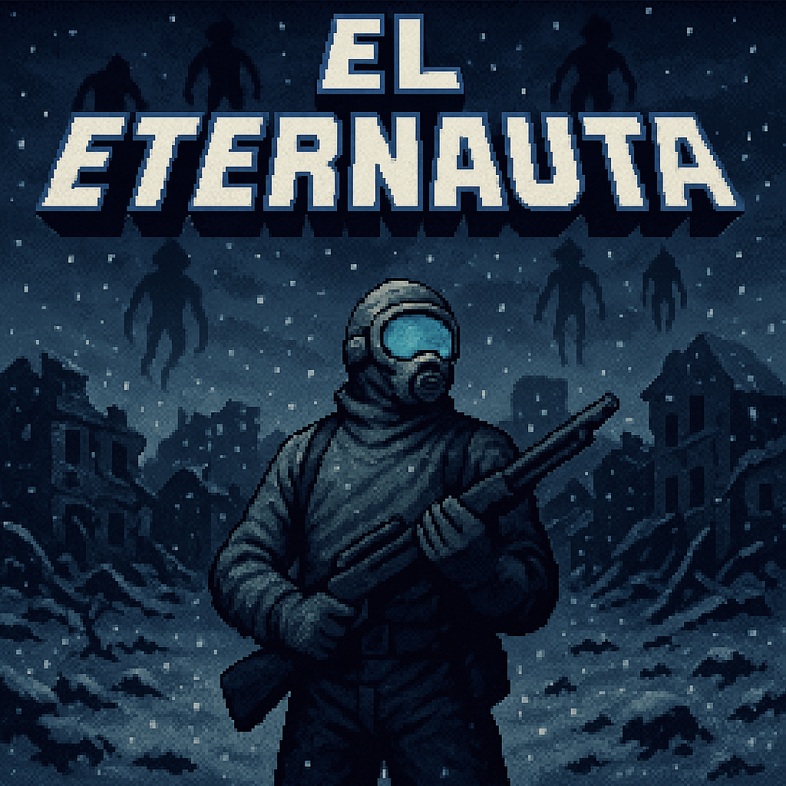

# 🚀 Shooter Infinito: *El Eternauta*



> Un juego hecho en Python con PyGame, inspirado en la mítica historieta argentina **El Eternauta**. ¡Sobreviví oleada tras oleada enfrentando a los cascarudos en una Buenos Aires post-apocalíptica!

---

## 🎮 Descripción del juego

Shooter 2D con scroll vertical e infinito. El jugador dispara a enemigos que caen desde arriba. La dificultad aumenta con el tiempo. Hay sistema de puntaje y ranking.

---

## 🕹️ Controles

- `←` / `→`/ `↑`/ `↓` → Mover
- `ESPACIO` → Disparar

---

## 📸 Capturas


---

## ⚙️ Requisitos

- Python 3.10+
- PyGame


pip install pygame

---

## ▶️ Ejecutar el juego

python juego.py

---

## 👥 Integrantes del grupo

- Julian Fernandez

- Mateo Irizarri 

- Agustin Dugo

---

## 📜 Licencia

Trabajo práctico de la materia Programación 1 – UTN

```bash